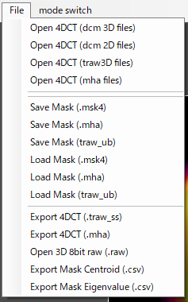

[English](RoiPainter4D_README_en.md)
# RoiPainter4D

[**RoiPainter4D**](RoiPainter4D_README.md) | [**I/O**](IO.md) | [**Visualization**](Vis.md) | [**Segmentation**](Segm.md)

## Input / Output functions of RoiPainter4D
RoiPainter4Dでのデータの読み込みと書き出しについての説明です．

**Open data** 
[D-1) file > Open dcm 3D](リンクのURL) 
[D-2) file > Open dcm 2D](リンクのURL) 
[D-3) file > Open traw 3D](リンクのURL) 
 
**Save and Load mask** 
[M-1) file > Save Mask(.msk4)](リンクのURL) 
[M-2) file > Load Mask(.msk4)](リンクのURL)

 

## Open 4DCT data
4DCT画像（dcm，traw3d，mha）を読み込みます．

以下の手順で4DCT画像を読み込みます．
1. メインウィンドウ左上のFileメニューから，ファイルの形式に応じた`Open 4DCT`を選択します．
2. ファイル選択ウィンドウより，読み込む4DCT画像のファイルを**すべて**選択します．
3. ファイルの読み込む順番を変更できます．特に問題が無ければ，`Import Files`を選択します．
4. しばらくすると，読み込みが完了します．

<!-- load_4dct.mp4 -->
https://github.com/user-attachments/assets/47884331-e0bb-47e1-a75e-43cf0e63fb50

## Save and Load Mask
### Save Mask
作成したマスクをマスクデータ（.msk4，.mha，.traw3d_ub）として保存します．

### Load Mask
マスクデータ（.msk4，.mha，.traw3d_ub）を読み込みます．ソフトウエア上でマスクを作成中・編集中の場合，そのマスクデータが上書きされるので注意してください．

4DCT画像を読み込んだら，以下の手順でマスク画像を読み込みます．
1. メインウィンドウ左上のFileメニューから，ファイルの形式に応じた`Load Mask`を選択します．
2. ファイル選択ウィンドウより，読み込むマスク画像のファイルを**すべて**選択します．
3. スタック方向を逆転するか選択するダイアログが出現します．基本的に「いいえ」を選択します．  
読み込むファイルによってはスタック方向が逆になっているので，「いいえ」を選択して上手くいかなかった場合は1.からやり直して「はい」を選択してください．
4. しばらくすると，読み込みが完了します．

<!-- load_mask.mp4 -->
https://github.com/user-attachments/assets/c3a25626-7648-4a00-aba5-ed6be988611d

## Export
### Export 4DCT 
現在読み込んである画像データを保存します．

[RoiPainter4D Top](RoiPainter4D_README.md)