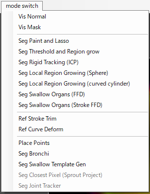

[English](RoiPainter4D_README_en.md)
# RoiPainter4D

[**RoiPainter4D**](RoiPainter4D_README.md) | [**I/O**](RoiPainter4D_IO.md) | [**Visualization**](RoiPainter4D_Visualization.md) | [**Segmentation**](RoiPainter4D_Segmentation.md) | [**Refinement**](RoiPainter4D_Refinement.md)

## 領域分割 / Segmentation

Roipainter4Dでは，以下のSegmantationツールを用いて4次元CT画像を領域分割することが可能です．あるツールで領域を分割し "Finish Segmentation" ボタンを押すと，前景領域に固有のIDが付与されます．一つの画素には一つのIDをつけることができ（一つの画素が複数のIDを持つことはできません），IDの種類は最大 255です．
画像読み込み時、初期値としてすべての画素にID=0が付与されています.
領域分割データは, マスクデータとして保存・読み込み可能です．また，形状モデル（wavefront obj）として出力することも可能です．

<strong> Segmentation </strong>  
<a href="#s1_seg_paintlasso"> S-1) mode switch > Seg Paint and Lasso </a>  
<a href="#s2_seg_threshold"> S-2) mode switch > Seg Threshold and Region grow </a>  
<a href="#s3_seg_rigid"> S-3) mode switch > Seg Rigid Tracking (ICP) </a>  
<a href="#s4_seg_local_sphere"> S-4) mode switch > Seg Local Region Growing (Sphere) </a>  
<a href="#s5_seg_local_cylinder"> S-5) mode switch > Seg Local Region Growing (curved cylinder) </a>  
<a href="#s6_seg_swallow_ffd"> S-6) mode switch > Seg Swallow Organs (FFD) </a>  
<a href="#s7_seg_swallow_stroke"> S-7) mode switch > Seg Swallow Organs (Stroke FFD) </a>  

 

### Seg Paint and Lasso

voxelを直接ペイントしたり，lassoで囲む事で領域を分割するツールです．手間と時間がかかるので，他のツールではどうしてもうまく分割できない領域に利用すると良いです．

### Seg Threshold and Region grow

閾値処理や，閾値を利用した領域拡張法により領域を分割するツールです．他の領域と輝度値の差が大きい領域（骨や造影剤など）の分割に利用できます．

**閾値による分割**

<!-- seg_threshold.mp4 -->
https://github.com/user-attachments/assets/b33239ae-5eb3-402b-9991-46465c18e6e3

**領域成長法による分割**

<!-- seg_regiongrow.mp4 -->
https://github.com/user-attachments/assets/ad05cb05-0181-4a32-aba2-6a23aa99986c

### Seg Rigid Tracking (ICP) 

剛体追跡（Rigid Tracking）により分割するツールです． シードとなる領域形状Aと等値面の閾値を与えると，その領域を等値面にフィットするように剛体変換する事で全てのフレームの分割が可能です． 剛体運動する領域（骨など）の分割に利用できます．

### Seg Local Region growing (shere)

球体状のシードを複数配置すると，そのシード領域内のみで領域拡張が行なわれるツールです． これにより，輝度値にむらのある領域でもうまく分割できる事が有ります．

### Seg Local Region growing (cylinder)

円筒状のシードを複数配置すると，そのシード領域内のみで領域拡張が行なわれるツールです． これにより，輝度値にむらのある領域でもうまく分割できる事が有ります．

### Seg Swallow Organs (FFD)

テンプレート形状（メッシュと変形用ケージ）を読み込み，ケージの制御点をマウスで直接操作して形状を変形（FFD: Free-Form Deformation）させることで領域を分割するツールです．

### Seg Swallow Organs (strokeFFD)

テンプレート形状（メッシュと変形用ケージ）を読み込み，画面上に曲線（ストローク）を描画することで，その曲線に沿うようにモデルを変形（Stroke FFD：曲線制約によるモデル変形）させて領域を分割するツールです．

[RoiPainter4D Top](RoiPainter4D_README.md)